# Clase Cinco - 2 de Septiembre del 2025

## Herramientas para Scaffolding de Proyectos

Similar a Replit : https://lovable.dev/
   
* Genera muy buenas interfaces de pantalla ademas del scaffolding
* Admite proyectos con base de datos con Supabase
         * https://supabase.com/
* Genera codigo en react
* Se puede generar un repo en github con el proyecto para descargar archivos
* La version gratuita no me permite editar para descargar tengo que pasar por github
* Hacer sin login
   

Para generar el prompt utilize ChatGPT y le puse

```
Crear un prompt para un MVP con lovable para un sistema de turnos que se pueda utilizar en distintos rubros tanto medico, hotel, administrativo,etc.
```
y chatgpt me genero

```
Acá te dejo un **prompt bien armado para Lovable** que apunta a un **MVP de sistema de turnos multipropósito** (médico, hotel, administrativo, etc.), manteniendo la idea de algo simple pero escalable:

---

### Prompt para Lovable

Quiero que generes un **MVP de un sistema de turnos online**, multipropósito y adaptable a distintos rubros (médico, hotelero, administrativo, peluquería, etc.).

📌 **Requerimientos principales del MVP:**

1. **Usuarios y roles**:

   * Administrador (configura rubro, horarios, disponibilidad, reglas de turnos).
   * Cliente/Usuario final (reserva, cancela, consulta sus turnos).

2. **Gestión de turnos**:

   * Alta, modificación y cancelación de turnos.
   * Definición de horarios disponibles según rubro.
   * Prevención de superposición de turnos.

3. **Interfaz**:

   * Simple, responsive y minimalista.
   * Vista de calendario o lista de turnos disponibles.
   * Formulario de reserva con datos básicos (nombre, email/teléfono, rubro).

4. **Notificaciones (opcional en MVP)**:

   * Confirmación/cancelación vía email o notificación interna.

5. **Configuración flexible por rubro**:

   * Poder definir campos adicionales según el rubro (ej: médico → especialidad, hotel → tipo de habitación, administrativo → trámite).

6. **Tecnología sugerida (si aplica)**:

   * Backend ligero con base de datos para turnos y usuarios.
   * Frontend claro con componentes de calendario/lista.
   * Arquitectura modular para poder escalar luego.

⚡ El objetivo es que el sistema sea **sencillo de usar**, **escalable** y pueda adaptarse a distintos escenarios sin rehacer todo desde cero.

---

¿Querés que te lo arme yo ya en formato **prompt optimizado para Lovable** (con estilo instructivo, como si fuera un input directo para la IA), o lo dejamos como guía y vos lo copias y adaptas?

```

> MVP : Minimum Viable Producto


## IA para System Design (Disenio de Sistemaas)

### Diagram GPT

Herramienta para digramar y generar la arquitectura de la aplicacion

> https://www.eraser.io/diagramgpt

Prompt utilizado (mas pro si lo pasaramos por chaatgpt)

```
Generame un diagraama de arquitectrua para una aplicacion tipo netflix que voy a hacer deploy en Azure
```

Ver imagen en diagramgpt/

* Permite importar diagramas de otras herramientas como Draw.io o lucidchart
* Permite subir los diagramas a github
* Permite exprotar los diagramas como imagen


### Lenguaje general para hacer diagramas

Mermaid
> https://mermaid.live/

ChatGPT y cualquier llm (en especial Claude) saben generar diagramas mermaid...

Por ejemplo a ChatGPT le puedo decir

```
Generame un diagrama de secuenca en mermaid que muestre en detalle la autenticacion oauth
```

y me va  a generar algo como lo siquitente

```mermaid
sequenceDiagram
    participant Usuario
    participant Cliente as Aplicación Cliente
    participant Navegador
    participant ServidorAutorizacion as Servidor de Autorización
    participant ServidorRecursos as Servidor de Recursos

    Usuario->>Navegador: Accede a la aplicación
    Navegador->>Cliente: Solicita acceso a un recurso protegido
    Cliente->>Navegador: Redirige al Servidor de Autorización<br/>con client_id, scope, redirect_uri

    Navegador->>ServidorAutorizacion: Solicitud de autorización
    ServidorAutorizacion->>Usuario: Pide credenciales y consentimiento
    Usuario->>ServidorAutorizacion: Ingresa credenciales y otorga permisos

    ServidorAutorizacion->>Navegador: Redirige a redirect_uri<br/>con código de autorización
    Navegador->>Cliente: Entrega el código de autorización

    Cliente->>ServidorAutorizacion: Intercambia código por Access Token<br/>(+ Client Secret)
    ServidorAutorizacion->>Cliente: Devuelve Access Token (+ opcional Refresh Token)

    Cliente->>ServidorRecursos: Solicita recurso con Access Token
    ServidorRecursos->>Cliente: Devuelve recurso protegido
    Cliente->>Usuario: Muestra los datos autorizados

```



Claude soporta Mermaid con sus artefactos de forma nativa. Se le puede pedir algo como\\
Prompt para Claude:
```
Haceme un artefacto con el diagrama de clases mermaid para un videoclub. Que sea completo, profesional y listo para una aplicacion del mundo real. Solo la parte del modelo.
```
    
y va a generarar algo asi directamente como artefacto:
     
```
classDiagram
    class Cliente {
        -Long id
        -String nombre
        -String apellido
        -String dni
        -String telefono
        -String email
        -String direccion
        -LocalDate fechaNacimiento
        -LocalDateTime fechaRegistro
        -EstadoCliente estado
        -BigDecimal saldoPendiente
        +registrarCliente()
        +actualizarDatos()
        +suspenderCliente()
        +calcularMultas()
        +obtenerHistorialAlquileres()
    }

    class Pelicula {
        -Long id
        -String titulo
        -String director
        -Integer añoEstreno
        -Integer duracionMinutos
        -String sinopsis
        -ClasificacionEdad clasificacion
        -String paisOrigen
        -String idioma
        -LocalDateTime fechaRegistro
        +buscarPorTitulo()
        +buscarPorDirector()
        +buscarPorGenero()
        +obtenerCopias()
    }

    class Copia {
        -Long id
        -String codigoBarras
        -EstadoCopia estado
        -FormatoCopia formato
        -LocalDate fechaAdquisicion
        -BigDecimal precioCompra
        -String ubicacionFisica
        -Integer vecesAlquilada
        +marcarDisponible()
        +marcarAlquilada()
        +marcarDañada()
        +calcularDepreciacion()
    }

    class Alquiler {
        -Long id
        -LocalDateTime fechaAlquiler
        -LocalDateTime fechaVencimiento
        -LocalDateTime fechaDevolucion
        -BigDecimal precio
        -EstadoAlquiler estado
        -String observaciones
        +calcularMulta()
        +procesarDevolucion()
        +extenderAlquiler()
        +generarRecibo()
    }

    class Empleado {
        -Long id
        -String nombre
        -String apellido
        -String dni
        -String telefono
        -String email
        -LocalDate fechaIngreso
        -BigDecimal salario
        -TipoEmpleado tipo
        -String turno
        -Boolean activo
        +procesarAlquiler()
        +procesarDevolucion()
        +registrarCliente()
        +generarReporte()
    }

    class Sucursal {
        -Long id
        -String nombre
        -String direccion
        -String telefono
        -String email
        -String horarioAtencion
        -Boolean activa
        -Integer capacidadCopias
        +obtenerInventario()
        +transferirCopia()
        +generarReporteVentas()
    }

    class Genero {
        -Long id
        -String nombre
        -String descripcion
        +obtenerPeliculas()
    }

    class Proveedor {
        -Long id
        -String nombre
        -String contacto
        -String telefono
        -String email
        -String direccion
        -Boolean activo
        +obtenerCatalogo()
        +procesarPedido()
    }

    class PedidoCopia {
        -Long id
        -LocalDateTime fechaPedido
        -LocalDateTime fechaEntrega
        -Integer cantidad
        -BigDecimal precioTotal
        -EstadoPedido estado
        +confirmarPedido()
        +procesarEntrega()
        +cancelarPedido()
    }

    class Multa {
        -Long id
        -BigDecimal monto
        -String concepto
        -LocalDateTime fechaGeneracion
        -LocalDateTime fechaPago
        -EstadoMulta estado
        -String metodoPago
        +procesarPago()
        +aplicarDescuento()
    }

    class Pago {
        -Long id
        -BigDecimal monto
        -LocalDateTime fecha
        -MetodoPago metodo
        -String numeroTransaccion
        -String observaciones
        +procesarPago()
        +generarComprobante()
        +anularPago()
    }

    class Reserva {
        -Long id
        -LocalDateTime fechaReserva
        -LocalDateTime fechaVencimiento
        -EstadoReserva estado
        -String observaciones
        +confirmarReserva()
        +cancelarReserva()
        +convertirAAlquiler()
    }

    Cliente "1" --> "0..*" Alquiler
    Cliente "1" --> "0..*" Multa
    Cliente "1" --> "0..*" Pago
    Cliente "1" --> "0..*" Reserva
    
    Pelicula "1" --> "0..*" Copia
    Pelicula "*" --> "*" Genero
    
    Copia "1" --> "0..*" Alquiler
    Copia "1" --> "0..*" Reserva
    
    Alquiler "1" --> "0..*" Multa
    Alquiler "*" --> "1" Empleado
    
    Empleado "*" --> "1" Sucursal
    Copia "*" --> "1" Sucursal
    
    Proveedor "1" --> "0..*" PedidoCopia
    PedidoCopia "*" --> "1" Pelicula
    PedidoCopia "*" --> "1" Sucursal
    
    Pago "*" --> "1" Alquiler
    Pago "*" --> "1" Multa
    Reserva "*" --> "1" Empleado
```

## OTra herramienta para digramas arquitectura

Structurizr

> https://structurizr.com/

Use este prompt en chatgpt

```
Generarme un diagrama de ejemplo de una arquitectura para utilizar con struturizr. Dame el texto en el lenguaje DSL de la herramienta
```

Me genero esto

```
workspace "Ejemplo Arquitectura Web" {

    model {
        user = person "Usuario" {
            description "Un usuario que accede a la aplicación desde un navegador web."
        }

        webApp = softwareSystem "Aplicación Web" {
            description "Sistema de reservas online."

            frontend = container "Frontend" {
                technology "React"
                description "Interfaz web para que los usuarios gestionen sus reservas."
            }

            backend = container "Backend API" {
                technology "Spring Boot"
                description "Expone una API REST para manejar lógica de negocio."
            }

            database = container "Base de Datos" {
                technology "PostgreSQL"
                description "Almacena información de usuarios, reservas y pagos."
            }

            user -> frontend "Usa" "HTTPS"
            frontend -> backend "Consume API" "JSON/HTTPS"
            backend -> database "Lee y escribe datos" "JDBC"
        }
    }

    views {
        systemContext webApp {
            include *
            autolayout lr
            title "Diagrama de Contexto"
        }

        container webApp {
            include *
            autolayout lr
            title "Diagrama de Contenedores"
        }

        theme default
    }
}

```

