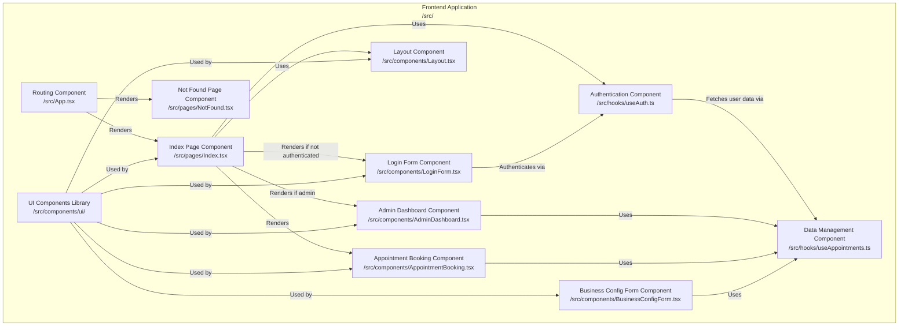

# Unnamed CodeViz Diagram

```mermaid
graph TD

    subgraph frontend_app["Frontend Application<br>/src/"]
        routing_comp["Routing Component<br>/src/App.tsx"]
        auth_comp["Authentication Component<br>/src/hooks/useAuth.ts"]
        data_mgmt_comp["Data Management Component<br>/src/hooks/useAppointments.ts"]
        ui_components_lib["UI Components Library<br>/src/components/ui/"]
        index_page["Index Page Component<br>/src/pages/Index.tsx"]
        not_found_page["Not Found Page Component<br>/src/pages/NotFound.tsx"]
        admin_dashboard["Admin Dashboard Component<br>/src/components/AdminDashboard.tsx"]
        appointment_booking["Appointment Booking Component<br>/src/components/AppointmentBooking.tsx"]
        business_config_form["Business Config Form Component<br>/src/components/BusinessConfigForm.tsx"]
        login_form["Login Form Component<br>/src/components/LoginForm.tsx"]
        layout_comp["Layout Component<br>/src/components/Layout.tsx"]
        %% Edges at this level (grouped by source)
        routing_comp["Routing Component<br>/src/App.tsx"] -->|"Renders"| index_page["Index Page Component<br>/src/pages/Index.tsx"]
        routing_comp["Routing Component<br>/src/App.tsx"] -->|"Renders"| not_found_page["Not Found Page Component<br>/src/pages/NotFound.tsx"]
        index_page["Index Page Component<br>/src/pages/Index.tsx"] -->|"Uses"| auth_comp["Authentication Component<br>/src/hooks/useAuth.ts"]
        index_page["Index Page Component<br>/src/pages/Index.tsx"] -->|"Renders if not authenticated"| login_form["Login Form Component<br>/src/components/LoginForm.tsx"]
        index_page["Index Page Component<br>/src/pages/Index.tsx"] -->|"Uses"| layout_comp["Layout Component<br>/src/components/Layout.tsx"]
        index_page["Index Page Component<br>/src/pages/Index.tsx"] -->|"Renders if admin"| admin_dashboard["Admin Dashboard Component<br>/src/components/AdminDashboard.tsx"]
        index_page["Index Page Component<br>/src/pages/Index.tsx"] -->|"Renders"| appointment_booking["Appointment Booking Component<br>/src/components/AppointmentBooking.tsx"]
        auth_comp["Authentication Component<br>/src/hooks/useAuth.ts"] -->|"Fetches user data via"| data_mgmt_comp["Data Management Component<br>/src/hooks/useAppointments.ts"]
        login_form["Login Form Component<br>/src/components/LoginForm.tsx"] -->|"Authenticates via"| auth_comp["Authentication Component<br>/src/hooks/useAuth.ts"]
        admin_dashboard["Admin Dashboard Component<br>/src/components/AdminDashboard.tsx"] -->|"Uses"| data_mgmt_comp["Data Management Component<br>/src/hooks/useAppointments.ts"]
        appointment_booking["Appointment Booking Component<br>/src/components/AppointmentBooking.tsx"] -->|"Uses"| data_mgmt_comp["Data Management Component<br>/src/hooks/useAppointments.ts"]
        business_config_form["Business Config Form Component<br>/src/components/BusinessConfigForm.tsx"] -->|"Uses"| data_mgmt_comp["Data Management Component<br>/src/hooks/useAppointments.ts"]
        ui_components_lib["UI Components Library<br>/src/components/ui/"] -->|"Used by"| index_page["Index Page Component<br>/src/pages/Index.tsx"]
        ui_components_lib["UI Components Library<br>/src/components/ui/"] -->|"Used by"| admin_dashboard["Admin Dashboard Component<br>/src/components/AdminDashboard.tsx"]
        ui_components_lib["UI Components Library<br>/src/components/ui/"] -->|"Used by"| appointment_booking["Appointment Booking Component<br>/src/components/AppointmentBooking.tsx"]
        ui_components_lib["UI Components Library<br>/src/components/ui/"] -->|"Used by"| business_config_form["Business Config Form Component<br>/src/components/BusinessConfigForm.tsx"]
        ui_components_lib["UI Components Library<br>/src/components/ui/"] -->|"Used by"| login_form["Login Form Component<br>/src/components/LoginForm.tsx"]
        ui_components_lib["UI Components Library<br>/src/components/ui/"] -->|"Used by"| layout_comp["Layout Component<br>/src/components/Layout.tsx"]
    end

```
---
*Generated by [CodeViz.ai](https://codeviz.ai) on 9/9/2025, 10:41:18 AM*
