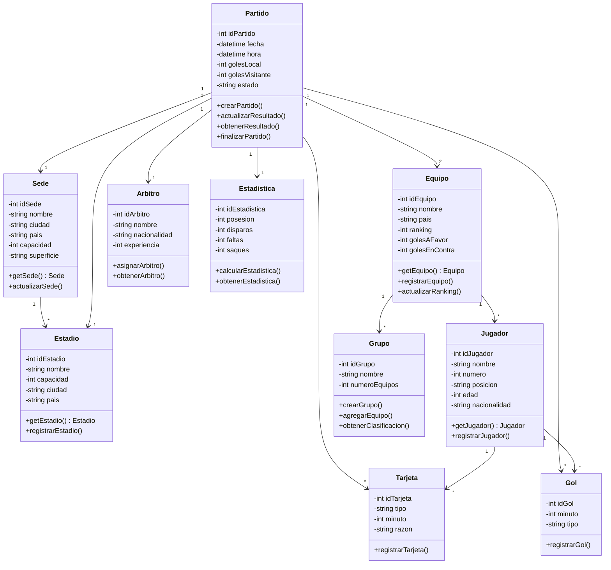

# Clase Cuatro 
# 29 de Diciembre del 2025 
# Ultima Clase

# Repaso

* Herramientas
  * Scaffolding de Proyectos
    * Replit
* Ides Con IA
    * Cursor
      * MCP en Cursor
      * Cursor Rules
      * Comandos Custom
* Patrones de Prompting
    * High Level Goal
* Base de datos Vectoriales

# Herramientas

* Compendio de Herramientas : https://www.instagram.com/p/C_wcgQWxuaB/?img_index=1

- ## Lovable

> https://lovable.dev/

* Generar el prompt para el MVP (Minimum Viable Product)

```
Generame el prompt para lovable para un mvp donde se muestra el fixture para el mundial 2026 para ir completando el resultado de los partidos. Buscar info sobre lo que se conoce. Devolveme el prompt sin acotar nada mas.
```

* Tiene el modo dictado incorporado para Vibe Coding

```
Generá un MVP que muestre el fixture del Mundial FIFA 2026 para que los usuarios puedan completar los resultados de los partidos.

Crear una interfaz simple tipo MVP con las siguientes características:

Objetivo
Permitir visualizar el fixture del Mundial 2026 y cargar manualmente los resultados de los partidos a medida que se juegan.

Alcance funcional
– Mostrar el fixture conocido del Mundial FIFA 2026
– Permitir ingresar y editar resultados partido por partido
– No calcular posiciones ni lógica compleja: solo carga y visualización de resultados
– Persistencia simple (estado local o storage básico)

Datos conocidos a considerar
– Mundial organizado en Estados Unidos, México y Canadá
– 48 selecciones
– 12 grupos (A a L)
– Fase de grupos compuesta por partidos con fecha, hora, grupo, estadio y ciudad
– Existen equipos aún por definir (repechajes / cupos UEFA, AFC, etc.) que deben mostrarse como “Por definir”
– Los primeros partidos comienzan en junio de 2026
– El partido inaugural se juega en el Estadio Azteca (México)
– Estadios y sedes ya están definidos aunque algunos cruces no

UI / UX
– Vista principal: listado o tabla de partidos
– Cada partido debe mostrar:
· Fecha
· Grupo
· Equipo A vs Equipo B
· Estadio / Ciudad
· Inputs para cargar goles de cada equipo
– Inputs numéricos simples para resultados
– Botón “Guardar resultado” o guardado automático
– Filtros por grupo y por fecha
– Diseño limpio, minimalista, enfocado en carga rápida de datos

Modelo de datos sugerido
Cada partido debe manejar una estructura similar a:
– id
– group
– date
– time
– team1
– team2
– stadium
– city
– scoreTeam1 (nullable)
– scoreTeam2 (nullable)

Comportamiento
– Al cargar la app se muestran los partidos con resultados vacíos
– El usuario puede completar o editar resultados en cualquier momento
– Los partidos con equipos no definidos deben mostrarse claramente como “TBD” o “Por definir”
– No generar lógica de clasificación ni eliminación, solo fixture + resultados

Restricciones
– Enfoque MVP: sin autenticación, sin backend complejo
– Código claro y extensible
– Pensado para evolucionar luego a tabla de posiciones y playoffs

Resultado esperado
Una app funcional generada que permita simular y completar el fixture del Mundial 2026 de forma simple y ordenada.
```

* Destaca en las UX generadas. Tienen buen Disenio.
* Puntaje : 10 / 10
  

- ## Bolt

> https://bolt.new/

* Importar desde figma
* Integrar con Github
* Herramienta de Stackblitz
* Utiliza Nativamente los modelos de Claude para programar

* Puntaje : 9 / 10
* Lovable genera interfaces mas lindos

- ## Base44

> [https://base44.com/](https://app.base44.com/register?ref=LWMWT446D4H29D98)

* Generamos el mismo proyecto para probar...
* MALISIMO : Para bajar el ZIP o integrar con Github requiere plan pro
* Puntaje : 8 / 10

# IA en System Design

* Estamos hablando de definir la arquitectua del proyecto como paso previo a la programacion.
* Generalmente esto se logra mediante diagramas (los planos del sistema)
* Herramientas como draw.io me permiten generar diagramas
* Como hacemos si queremos generar Diagramas con IA

- ## Mermaid

> https://mermaid.live/

* Es un lenguaje para generar diagramas a partir de texto
* Se integra diractamete con los artefactos de Claude
* Para mostrar diagramas mermaid en tu proyecto : https://mermaid.js.org/
* Por ejemplo con claude

```
Generar un artefacto con un diagrama de clases utilizando mermaid con el modelo de un sistema para manejar los partidos del mudial 2026 (Sede, Partido, Equipo, etc)
```

* Me genero este diagrama



- ## Diagram GPT

> https://www.eraser.io/diagramgpt

* Para generar diagramas enteros de la arquitectura del sistema a partir de un prompt
* Parte de la herramienta Eraser.IO que es parecido a draw.io para editar diagramas
* Se puede exportar a png
* El png se puede convertir a mermaid con Claude
* Puntaje : 10 / 10

# IA en Analisis 

- ## Relevamiento

* Hablar con el cliente
* Entrevistas
* Resumen Varias herramientas: https://www.instagram.com/p/DBzb-kHxqae/?img_index=1
* El profe usa : https://tactiq.io/
* Supongan que hacemos un relevamiento y tenemos varias entrevistas transcriptas

- ## Analisis

> https://notebooklm.google.com/

* NotebookLM es la herramienta del momento
* Tomar esas entrevistas
* Hacer el analisis
* La idea seria generar un chatbot con todos los documentos de analisis
* Reemplazar las preguntas al analista con este Chatbot  

# Ingenierons de Software con IA

* Divultativa : Todavia no se ha logrado el "Estado del arte" en los Ingenieros de Software por IA
* Agentes que desarrollan solo las aplicaciones a partir de los requerimientos, sin intervencion humana
* En su momento se hablaba de :
  * https://devin.ai/
  * https://devikaai.org/ (Version Open Source De Devin)
    * https://github.com/stitionai/devika
* Github Copilot Workspace
  * Trabaja directo integrado con Github
    * Haces un pull request a un proyecto y lo programa la IA
    * https://githubnext.com/projects/copilot-workspace
    * Integrado con la subscripcion de Github copilot
* Herramientas para programar agentes (Pagas)
