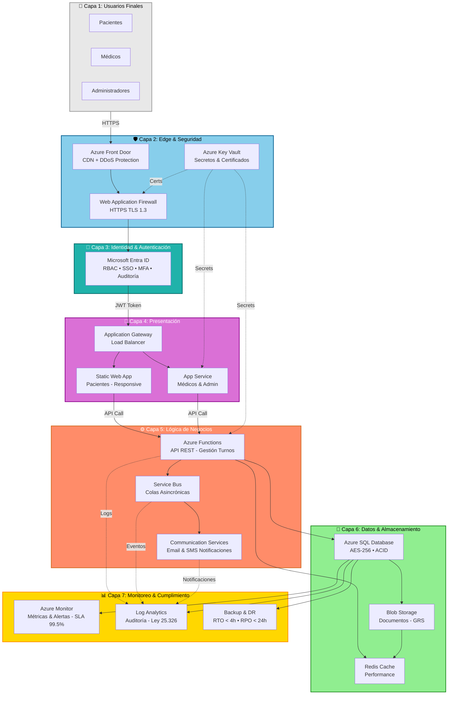

# Clase Cuatro - 9 de Abril del 2026

# Repaso

*Proceso
  * Prompt Engineering para DEVs (Analisis)
    * Generamos el prompt para el MVP (Mininum Viable Product)
  * Herramientas
      * Replit
          * Pasamos de prompt a App ===> El scaffolding del proyecto
  * Github
  * Bajamos localmeente
    * Entendiamos
    * Ejecutabamos
    * Modificamos con un Codding Assisgant << De este uso vamos a profundizar

# Frases de Alumnos

> En el trabajo publicaron que vayamos viendo este tema Spec Driven Development y como herramienta de GitHub GitHub Spec Kit

# Importante

* Hoy en dia como la IA se puede mandar muchas macanas y nuestro rol es coordinarla/orquestarla
* El manejo de las versiones de los fuentes en epocas de IA se vuelve critica

# Integracion

* Cuanto antes detectamos los problemas GRAVES en sistemas
    * Estamos hablando de problemas graves como que nos hackeen la base de datos y filtren datos sensibles


# Analisis

 * Muchas reuniones
 * Mucha informacion dispersa que hay que unificar
 * Mucha contradiccion entre distintos documentos y personas

## Problema : Reuniones

* Problema
  * Tengo muchas recuniones
  * La gente se dispersa
  * Las personas se contradicen
  * La informacion se pierde
* Solucion
  * Grabar las reuniones
  * Hay herramientas como MS teams que hace todo automatico o sino...
      * https://tactiq.io/es
  * Se hacen minutas
  * Las trancripciones, la minutas, los analisi de ChatGTP pasan a ser DOCUMENTACION

 > [!NOTA]
> De las reuniones obtengo documentos que van a ser parte del analisis que la ia va a utilizar


## Problema : Mucha documentacion desparramada


* Problemas
    * Documentos de analisis
    * Disenio
    * Reuniones
    * Mails
    * ...
    * No hay una trazabilidad 
* Solucion
    * Generar un Agente IA que tenga todos los documentos
          * Le pueda hacer todas las preguntas que quiera
          * Detecte contradicciones
          * Me ayude a entender todo el contexto y que falta
          * RAG (Retrival Augmented Generation)
      * NotebookLM
          * https://notebooklm.google.com/
          * MUY UTIL
          * Seria como armar un ChatGPT especializado en esta informacion
      * Puedo ver tambien otras opciones como Notion
          * A modo de ver segun el profe NotebookLM es mejor

---

# Diseño

##  Diseniar toda la infraestructura 

* Problema
    * Se poco de Azure
    * Se poco de AWS
    * Si vas a desplegar un app en Azure esto puede condicionar despues como hagas el codigo
    * Los Arquitectos de Azure son Caros
* Solucion
    * Diagramar la arquitectura con IA
        * ChatGPT y Mermaid
        * DiagramGPT
          * https://www.eraser.io/diagramgpt

* A NotebookLM le pido
```
Me piden definir toda la infraestructura para dar soporte a la solucion en Azure. Dame un prompt espefico para un agente de system design que me va a generar todo el diagrama para implementar la arquitectura
```
* Me devuelve el prompt que luego le paso a DiagramGPT le pido
```
### Prompt para el Agente de System Design

**Rol:** Actúa como un **Azure Solutions Architect Senior**.

**Contexto del Proyecto:**
Diseña la infraestructura en **Azure** para "Turnos Salud", un sistema de gestión de turnos médicos para la Clínica San Rafael. El sistema debe soportar una **aplicación web responsive** para pacientes, médicos y administradores.

**Requerimientos Críticos a Considerar:**
1.  **Escalabilidad y Rendimiento:** La arquitectura debe soportar **500 usuarios concurrentes** y asegurar tiempos de respuesta menores a **2 segundos** en operaciones críticas. Debe permitir el **escalado horizontal** y estar preparada para la incorporación de múltiples sucursales en el futuro.
2.  **Alta Disponibilidad:** Se requiere un **SLA del 99.5%**. Implementa estrategias de **Backup diario** y un plan de recuperación ante desastres con un **RTO < 4 horas** y **RPO < 24 horas**.
3.  **Seguridad y Cumplimiento:**
    *   Implementar **Control de Acceso Basado en Roles (RBAC)**.
    *   Garantizar comunicaciones vía **HTTPS** con certificados TLS.
    *   Cifrado de datos sensibles en reposo mediante **AES-256**.
    *   Cumplimiento con la **Ley de Protección de Datos Personales** (Ley 25.326).
4.  **Funcionalidades Clave:**
    *   Servicio de **notificaciones automáticas por email**.
    *   Capacidad de exposición de **APIs REST** para futuras integraciones con Historias Clínicas Electrónicas.
    *   Módulo de **reportes administrativos**.

**Componentes de Azure Sugeridos (Valida y Propón):**
*   **Frontend/Backend:** Azure App Services o Static Web Apps.
*   **Base de Datos:** Azure SQL Database o Azure Database for PostgreSQL (considerando el cifrado y consistencia transaccional).
*   **Identidad:** Microsoft Entra ID (Azure AD) para el RBAC y autenticación.
*   **Seguridad:** Azure Key Vault para secretos, Azure Front Door o Application Gateway con WAF para protección web.
*   **Monitoreo:** Azure Monitor y Log Analytics para auditoría y trazas.
*   **Mensajería:** Azure Communication Services o SendGrid para los recordatorios de turnos.

**Entregable Esperado:**
1.  **Diagrama de Arquitectura:** Una representación visual (o descripción estructurada para Mermaid/PlantUML) que muestre la disposición de los recursos.
2.  **Justificación de Componentes:** Por qué cada servicio de Azure cumple con los Requerimientos No Funcionales (RNF).
3.  **Flujo de Datos:** Descripción del camino de una solicitud desde el paciente hasta la base de datos, incluyendo las capas de seguridad.

***

### Detalles adicionales para tu diseño
Al usar este prompt, el agente podrá considerar aspectos específicos de las fuentes como:
*   La lógica de **prevención de superposición de turnos** (RN-07) que requiere una base de datos con alta integridad transaccional.
*   La necesidad de una **interfaz intuitiva** que no requiere gran capacidad de procesamiento en el cliente, pero sí una entrega de contenido rápida (CDN).
*   La importancia de los **logs de auditoría** para operaciones críticas (RNF-SEC-05), lo que justifica el uso intensivo de herramientas de monitoreo en la nube.
```

* Diagram GPT Me genero esto :


* Si en lugar de usar DiagramGPT quiero trabajar con ChatGPT para diagramas de diseño utilizo Mermaid
  * https://mermaid.live/
  * https://mermaid.js.org/  <<< Es una libreria de javascript, pagina oficial
 
* Voy a usar el mismo prompt pero con chatgpt o claude y le pido el diagrama de disenio en mermaid



