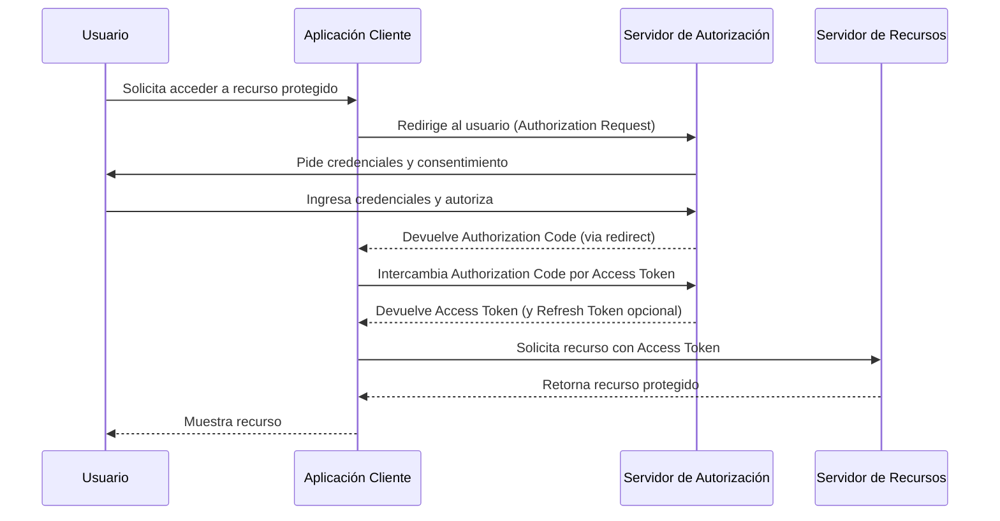

# Clase Tres - 22 de Septiembre de 2025

## Repaso

* V0 Chat (powered by Vercell)
* MCP (Model Context Protocol))
* Cursor : para hacer vibe coding
* Taqtic : Como ejemplo de app para tomar notas en reunione
* Notebook LM

## Scaffolding de proyectos y Vibe Coding

### Replit 

La artilleria pesada!
Nada mas ni nada menos...
> https://replit.com/

Caracteristicas 
* IDE online para editar proyectos con IA integada
* Integracion con Github
* Sirve para hacer VibeCoding
* Genera el scaffolding completo del proyecto con funcionalidad
* Generarlmente trabaja muy bien con React para el frontend
* No solo es para proyectos web sino que se puede hacer proyectos Dektop accedion por VNC por ejemplo un juego con PyGame
* Genera proyetos tanato con el Frotend y el Backend

Prompt genreado por ChatGPT para realizar el MVP (Minimum Viable Product)
```markdown
Requerimientos para un MVP de una aplicación tipo Amazon para vender insumos de electrónica:

* **Usuarios**: registro, login/logout, perfil básico (nombre, email).
* **Catálogo de productos**: listado con nombre, imagen, precio, descripción, stock; búsqueda por nombre; filtros por categorías; detalle de producto.
* **Carrito de compras**: agregar, modificar cantidades, eliminar, calcular total.
* **Checkout simple**: confirmar pedido con datos de envío, pago simulado.
* **Categorías**: visualización y asociación de productos.
* **Administración mínima**: CRUD de productos y categorías.
* **Persistencia en memoria**: manejar datos en estructuras temporales, preparado para migrar a base de datos a futuro.
* **Diseño moderno**: responsive, tipografía clara, cards de productos con sombras suaves, barra superior con buscador y carrito, navegación por categorías.
* **Requisitos no funcionales**: seguridad básica (hash de contraseñas, validación), buena performance (lazy loading en imágenes), arquitectura preparada para escalar.

```

Puntaje : 10 / 10 

### Base 44

Alternativa a Replit

> https://base44.com/

Probe el mismo Prompt
  
Caracteristicas :
* Tiene disenios predefinidos para elegir
* Bueno para disenios Responsive///
  
Puntaje : 9 / 10

## IA para System Design

### Diagram GPT

Para no solo hacer diagramas sino que la IA me genere el diagrama pensando la solucion
> https://www.eraser.io/diagramgpt

Puntaje : 7/10

### Mermaid

Mermaid es un lenguaje estandarizado para realizar Graficos a partir de texto

> https://mermaid.live/

Por ejemplo generamos este diagrama en ChatGPT



Claude ya tiene previsualizacion de Mermaid en sus artefactos...
> https://claude.ai/public/artifacts/e8dd1a50-581c-429e-a3e8-d3a3e44f4ad6

Puntaje : 10/10
 
### Struturizr

> https://structurizr.com/    
Tutorial
> https://docs.structurizr.com/dsl/tutorial

Prompt Utilizado
```
Generame con el DSL de struturizr un diagrama donde se vea la arquitectura real del sistema de un banco
```

Puntaje : ??/10 (Demaasiados intentos con ChatGPT para que genere un diagrama viable)


### CodeViz

Herramienta para documetar visualmente proyectos existentes...
* Es una extension de VSCode
* Abrimos un proyecto existente y podemos visualizarlo como Diagrama

Puntaje 8/10

## Herramientas para Aplicaciones Interactivas

### WebSim

> https://websim.com/

prompt

```
Generame un juego estilo Flappy Birds
```
(Resultado subido al github)

Puntaje : 7 / 10 

