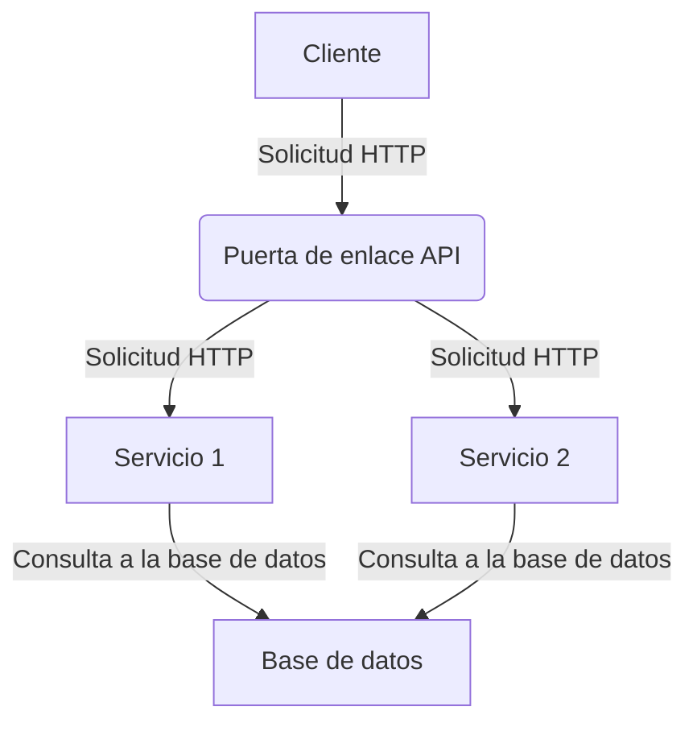

# 🤖 Sugerencias de prompts de ChatGPT para desarrolladores

¡Bienvenido a esta super colección  de sugerencias de prompts de ChatGPT para desarrolladores! 🙌

Aqui puedes encontrar una lista de potentes sugerencias de prompts de ChatGPT que pueden ayudarte a estimular tu creatividad. 💡 Ya seas principiante o profesional experimentado, estas sugerencias pueden ayudarte a pensar fuera de lo convencional y encontrar nuevas soluciones a los problemas. 🚀

😊 ¡Vamos a sumergirnos de lleno en estas poderosas sugerencias de prompts de ChatGPT que pueden ayudarte a llevar tu creatividad al siguiente nivel! 🌊

## Tabla de Contenidos

Sugerencias para programadores

- [🚩 Consejos](#-consejos)
- [🔗 Un enfoque de múltiples prompts (encadenamiento de prompts)](#-un-enfoque-de-múltiples-prompts-encadenamiento-de-prompts)
  - [1. Modernizar y agregar las mejores prácticas](#1-modernizar-y-agregar-las-mejores-prácticas)
  - [2. Revisa tu código en busca de errores lógicos y problemas de seguridad](#2-revisa-tu-código-en-busca-de-errores-lógicos-y-problemas-de-seguridad)
  - [3. Validar las recomendaciones (reflexión)](#3-validar-las-recomendaciones-reflexión)
  - [4. Escribe el código](#4-escribe-el-código)
  - [5. Crear pruebas](#5-crear-pruebas)
- [Reescribir el prompt](#reescribir-el-prompt)
- [Optimizador de prompts de ChatGPT](#optimizador-de-prompts-de-chatgpt)
- [Solicitar alternativas](#solicitar-alternativas)
- [Documentación / Explicación](#documentación--explicación)
  - [📣 Agregar documentación](#-agregar-documentación)
  - [📣 Escribir tus términos y condiciones](#-escribir-tus-términos-y-condiciones)
  - [📣 Producir hojas de referencia](#-producir-hojas-de-referencia)
  - [📣 Generar archivos Readme](#-generar-archivos-readme)
  - [📣 Escribir blogs detallados](#-escribir-blogs-detallados)
  - [📣 Explicar código](#-explicar-código)
  - [📣 Diagrama de arquitectura (Mermaid)](#-diagrama-de-arquitectura-mermaid)
  - [📣 Diagrama de relación de entidades (Mermaid)](#-diagrama-de-relación-de-entidades-mermaid)
  - [📣 Crear Script para concatenar archivos del proyecto de uno solo](#-diagrama-de-relación-de-entidades-mermaid).
- [Refactorización de código](#refactorización-de-código)
  - [📣 Refactorizar código](#-refactorizar-código)
  - [📣 Modernizar código antiguo](#-modernizar-código-antiguo)
  - [📣 Dividir código en múltiples métodos](#-dividir-código-en-múltiples-métodos)
  - [📣 Mejor rendimiento](#-mejor-rendimiento)
  - [📣 Agregar un parámetro a una función](#-agregar-un-parámetro-a-una-función)
  - [📣 Agregar mejores prácticas o principios de codificación](#-agregar-mejores-prácticas-o-principios-de-codificación)
  - [📣 Seguir las pautas de estilo de codificación](#-seguir-las-pautas-de-estilo-de-codificación)
  - [📣 Detectar y corregir errores](#-detectar-y-corregir-errores)
  - [📣 Depurar un componente de React](#-depurar-un-componente-de-react)
  - [📣 Crear pruebas unitarias](#-crear-pruebas-unitarias)
  - [📣 Transpilar código](#-transpilar-código)
  - [📣 Diseño adaptable](#-diseño-adaptable)
  - [📣 Internacionalización](#-internacionalización)
  - [📣 Agregar comentarios al código](#-agregar-comentarios-al-código)
- [Generación de código](#generación-de-código)
  - [📣 Crear funciones](#-crear-funciones)
  - [📣 Generar un Dockerfile](#-generar-un-dockerfile)
  - [📣 Escribir una Expresión Regular](#-escribir-una-expresión-regular)
  - [📣 Crear una clase](#-crear-una-clase)
  - [📣 Agregar funcionalidad](#-agregar-funcionalidad)
  - [📣 Crear código base](#-crear-código-base)
  - [📣 Eres un ingeniero de software de clase mundial](#-eres-un-ingeniero-de-software-de-clase-mundial)
- [Revisión de código](#revisión-de-código)
  - [📣 Manejo de errores](#-manejo-de-errores)
  - [📣 Sugerir mejoras](#-sugerir-mejoras)
- [Promoción de productos y servicios](#promoción-de-productos-y-servicios)
  - [📣 Generar ideas de productos innovadoras](#-generar-ideas-de-productos-innovadoras)
  - [📣 Desarrollar una propuesta de valor única](#-desarrollar-una-propuesta-de-valor-única)
  - [📣 Dominar el arte de contar historias para el marketing](#-dominar-el-arte-de-contar-historias-para-el-marketing)
  - [📣 Crear un programa de referidos exitoso](#-crear-un-programa-de-referidos-exitoso)
  - [📣 Dominar el arte de venta cruzada y aumento de venta](#-dominar-el-arte-de-venta-cruzada-y-aumento-de-venta)
  - [📣 Crear una campaña de marketing viral](#-crear-una-campaña-de-marketing-viral)
  - [📣 Desarrollar una presentación de ascensor poderosa](#-desarrollar-una-presentación-de-ascensor-poderosa)
  - [📣 Crear un plan de marketing efectivo](#-crear-un-plan-de-marketing-efectivo)
  - [📣 Aprovechar el marketing de contenido para la generación de leads](#-aprovechar-el-marketing-de-contenido-para-la-generación-de-leads)

## 🚩 Consejos

Al igual que muchas cosas en la vida, con GPT-4, obtienes lo que pones. En este caso, proporcionar más contexto, instrucciones y orientación generalmente producirá mejores resultados.

Aquí hay algunos consejos y técnicas para mejorar:

- **Divide tus prompts:**
Intenta dividir tus prompts y el resultado deseado en varios pasos. Mantener los prompts para que tengan un solo resultado ha demostrado producir mejores resultados que los prompts combinados. Por ejemplo, solicita una revisión y luego solicita un refactor en función de la respuesta a la revisión. Esto puede volverse menos importante con el tiempo a medida que los modelos de lenguaje aumenten su límite de tokens.

- **Proporciona ejemplos:**
Proporciona entradas, datos y salidas esperados para mejorar la calidad de la precisión. 📝

- **Sé específico:**
No tengas miedo de enumerar exactamente lo que quieres, lo que sabes, lo que se necesita y lo que no se debe incluir. 🔎

- **Pídelo que reflexione:**
Una técnica llamada reflexión ha demostrado aumentar la precisión de GPT4. Básicamente, pregúntale "¿Por qué estabas equivocado?" o hazlo reflexionar y revisar su propia respuesta. 🤔

## 🔗 Un enfoque de múltiples prompts (encadenamiento de prompts)

puede usarse para actualizar, refactorizar y revisar una pieza de código. Un conjunto de prompts bien diseñado es aquel en el que cada uno tiene preocupaciones separadas y responsabilidades singulares.

### 1. Modernizar y agregar las mejores prácticas

---

al hacer que GPT-4 vuelva a escribir tu código en el estilo que deseas. Este paso generalmente dará como resultado una salida coherente, en el estilo que deseas, pero puede introducir errores, por lo que lo hacemos primero.

**Prompt:**

```
Revisa el siguiente código y reescríbelo en los estándares y el formato de programación modernos de es6:

[insertar código aquí]
```

### 2. Revisa tu código en busca de errores lógicos y problemas de seguridad

---

Obtén recomendaciones para mejorar cualquier problema lógico o de seguridad introducido. Es importante que no pidamos un refactor, solo el razonamiento detrás de querer el refactor.

**Prompt:**

```
Revisa el código proporcionado 'tempFunction' en busca de problemas lógicos o de seguridad y proporciona una lista de recomendaciones.
```

### 3. Validar las recomendaciones (reflexión)

---

Valida las recomendaciones proporcionadas. La reflexión es una técnica poderosa para mejorar la precisión de las recomendaciones iniciales y tratar de eliminar cualquier alucinación. Esto no siempre es necesario, pero vale la pena preguntar si no estás seguro de alguna recomendación.

**Prompt:**

```
Revisa tus recomendaciones anteriores. Dime por qué estabas equivocado y si se pasaron por alto o se agregaron incorrectamente algunas recomendaciones.
```

### 4. Escribe el código

---

Combina tus revisiones, recomendaciones y comentarios para hacer que GPT-4 escriba tu nueva función.

**Prompt:**

```
Vuelve a escribir la función 'tempFunction' en función de tu revisión y recomendaciones.
```

### 5. Crear pruebas

---

Crea algunas pruebas sencillas que podamos ejecutar localmente y validar los resultados

**Prompt:**

```
Crea dos pruebas [ define la tecnología ] para la función 'tempFunction' anterior. Una que se espera que pase y otra que se espera que falle.
```

## Reescribir el prompt

Veamos si podemos hacer que GPT4 convierta nuestros prompts promedio en prompts de "viaje inspirador" tipo dominio.

**Prompt:**

```
[tu prompt]

Reescribe el texto anterior de forma más verbosa e incluyendo mucha descripción superflua sobre cada cosa, usa un lenguaje muy pictórico.
```

<sup>[⬆️ Volver a la tabla de contenidos](#tabla-de-contenidos)</sup>

## Optimizador de prompts de ChatGPT

**Prompt:**

```
Te proporcionaré un prompt de chatGPT. Harás preguntas para entender la audiencia y los objetivos, luego optimizarás el prompt para que sea más efectivo y relevante utilizando el principio de especificidad.
```

<sup>[⬆️ Volver a la tabla de contenidos](#tabla-de-contenidos)</sup>

## Solicitar alternativas

Si no estás satisfecho con tu solución, puedes pedirle a ChatGPT que te dé alternativas.

**Prompt:**

```
Te proporcionaré un fragmento de código que he realizado y
necesito que me des alternativas para hacer lo mismo de otra manera:

[INSERTA TU CÓDIGO AQUÍ]
```

<sup>[⬆️ Volver a la tabla de contenidos](#tabla-de-contenidos)</sup>

---

## Documentación / Explicación

### 📣 Agregar documentación

> [!NOTE]
> Agregar documentación requiere crear explicaciones claras y exhaustivas del propósito, diseño e implementación de un módulo.

Prompt 1#:

```
No sé cómo codificar, pero quiero entender cómo funciona esto. Explícame el siguiente código de una manera que una persona no técnica pueda entender. Usa Markdown con un buen formato para facilitar el seguimiento. Organízalo por secciones con encabezados. Incluye referencias al código como bloques de código de Markdown en cada sección. El código:

[insertar código aquí]
```

Prompt 2#:

```
Por favor, agrega documentación exhaustiva para [nombre de archivo o módulo], incluidas explicaciones claras y concisas de su propósito, diseño e implementación. Considera incluir ejemplos de cómo usar el módulo, así como diagramas o diagramas de flujo relevantes para ayudar a ilustrar su funcionamiento. Asegúrate de que la documentación esté fácilmente accesible para otros desarrolladores y se actualice a medida que evoluciona el módulo. Considera usar herramientas de documentación como comentarios en línea, archivos Markdown o un generador de documentación para simplificar el proceso.

[insertar código aquí]
```

<sup>[⬆️ Volver a la tabla de contenidos](#tabla-de-contenidos)</sup>

### 📣 Escribir tus términos y condiciones

**Prompt:**

```
Crea los términos y servicios para mi sitio web sobre una [herramienta de IA] llamada [nombre].
```

<sup>[⬆️ Volver a la tabla de contenidos](#tabla-de-contenidos)</sup>

### 📣 Producir hojas de referencia

**Prompt:**

```
Escribe una hoja de referencia para [formato de Markdown].
```

<sup>[⬆️ Volver a la tabla de contenidos](#tabla-de-contenidos)</sup>

### 📣 Generar archivos Readme

**Prompt:**

```
Genera documentación para el código a continuación. Debes incluir instrucciones detalladas para permitir que un desarrollador lo ejecute en una máquina local, explicar qué hace el código y enumerar las vulnerabilidades que existen en este código.

[ingresa el código]
```

<sup>[⬆️ Volver a la tabla de contenidos](#tabla-de-contenidos)</sup>

### 📣 Escribir blogs detallados

**Prompt:**

```
Escribe un blog detallado sobre cómo construir un [rastreador de COVID] usando React con una estructura adecuada del código.
```

<sup>[⬆️ Volver a la tabla de contenidos](#tabla-de-contenidos)</sup>

### 📣 Explicar código

> [!NOTE]
> No pierdas tiempo tratando de averiguar cómo funciona el código, simplemente pídele a ChatGPT que te lo explique.

**Prompt:**

```
Contexto: Estoy comenzando una nueva posición como desarrollador backend y tengo que empezar a entender cómo funcionan algunas funciones.
Tecnologías: [INSERTA TUS TECNOLOGÍAS AQUÍ]
Debes: Explicarme el código línea por línea.

[INSERTA TU CÓDIGO AQUÍ]
```

<sup>[⬆️ Volver a la tabla de contenidos](#tabla-de-contenidos)</sup>

### 📣 Diagrama de arquitectura (Mermaid)

> [!NOTE]
> Crea un diagrama de tu arquitectura usando Mermaid

**Prompt:**

```
Escribe el código Mermaid para un diagrama de arquitectura para esta solución [DESCRIBE LA SOLUCIÓN]
```

Ejemplo:



<sup>[⬆️ Volver a la tabla de contenidos](#tabla-de-contenidos)</sup>

### 📣 Diagrama de relación de entidades (Mermaid)

> [!NOTE]
> Crea un diagrama de relación de entidades usando Mermaid

**Prompt:**

```
Escribe el código Mermaid para un diagrama de relación de entidades para estas clases [INSERTA LAS CLASES]
```

<sup>[⬆️ Volver a la tabla de contenidos](#tabla-de-contenidos)</sup>

###  📣 Crear Script para concatenar archivos del proyecto de uno solo

> [!NOTE]
> Crear Script para concatenar archivos del proyecto de uno solo

**Prompt:**
```
Quiero hacer un script que parado en una carpeta tome todos los archivos .java y .xml de esa carpeta y subcarpetas y genere un unico archivo con el contenido de todos los archivos. El archivo de salida se llama proyecto,txt. Quiero que antes de poner el contenido de cada archivo agregue una linea de la forma //\[nombre del archivo\] que diga a que archivo corresponde el contenido que sigue a continuacion
## Refactorización de código
```
<sup>[⬆️ Volver a la tabla de contenidos](#tabla-de-contenidos)</sup>

### 📣 Refactorizar código

> [!NOTE]
> Pídele a ChatGPT que refactorice tu código

**Prompt:**

```
Tengo un fragmento de código y necesito que lo refactorices:

[INSERTA TU CÓDIGO AQUÍ]
```

La refactorización de código es un proceso esencial en el desarrollo de software que tiene como objetivo mejorar la calidad, legibilidad y mantenibilidad del código existente sin alterar su funcionalidad. La refactorización puede mejorar la eficiencia del código, reducir los errores y facilitar su modificación o extensión en el futuro. Con la ayuda de ChatGPT, puedes refactorizar eficazmente tu código y lograr una mejor estructura.

<sup>[⬆️ Volver a la tabla de contenidos](#tabla-de-contenidos)</sup>

### 📣 Modernizar código antiguo

> [!NOTE]
> Al proporcionar tu función antigua a GPT-4 y pedirle que la refactorice a las prácticas de codificación modernas, puedes modernizar rápidamente tu código.

**Prompt:**

```
Refactoriza el siguiente código a los estándares de programación modernos de es6:

[INSERTA TU CÓDIGO AQUÍ]
```

<sup>[⬆️ Volver a la tabla de contenidos](#tabla-de-contenidos)</sup>

### 📣 Dividir código en múltiples métodos

> [!NOTE]
>Si tienes una función larga que está haciendo demasiado, puedes pedirle a GPT-4 que la refactorice en múltiples métodos.

**Prompt:**

```
Refactoriza el siguiente código en múltiples métodos para mejorar la legibilidad y mantenibilidad:

[INSERTA TU CÓDIGO AQUÍ]
```

<sup>[⬆️ Volver a la tabla de contenidos](#tabla-de-contenidos)</sup>

### 📣 Mejor rendimiento

> [!NOTE]
> Si tienes una función que tarda demasiado en ejecutarse, puedes pedirle a GPT-4 que la refactorice para mejorar el rendimiento.

**Prompt:**

```
Refactoriza el siguiente código para mejorar el rendimiento:

[INSERTA TU CÓDIGO AQUÍ]
```

<sup>[⬆️ Volver a la tabla de contenidos](#tabla-de-contenidos)</sup>

### 📣 Agregar un parámetro a una función

**Prompt:**

```
Agrega un parámetro a esta función para hacer [FUNCIONALIDAD]

[INSERTA TU CÓDIGO AQUÍ]
```

<sup>[⬆️ Volver a la tabla de contenidos](#tabla-de-contenidos)</sup>

### 📣 Agregar mejores prácticas o principios de codificación

> [!NOTE]
>Deja que ChatGPT vuelva a escribir el código por ti de acuerdo con las pautas de estilo.

**Prompt:**

```
Vuelve a escribir el código a continuación siguiendo las pautas de estilo de javascript de Google.

[INSERTA TU CÓDIGO AQUÍ]
```

<sup>[⬆️ Volver a la tabla de contenidos](#tabla-de-contenidos)</sup>

### 📣 Seguir las pautas de estilo de codificación

> [!NOTE]
> Si tu organización o base de código utiliza prácticas y estilos de codificación específicos que deseas mantener, puedes proporcionar instrucciones a GPT-4 sobre qué práctica o estilo de codificación en particular te gustaría que se centrara.

**Prompt:**

```
Revisa el siguiente código y refactorízalo para hacerlo más seco y adoptar los principios de programación SOLID.

[INSERTA TU CÓDIGO AQUÍ]
```

<sup>[⬆️ Volver a la tabla de contenidos](#tabla-de-contenidos)</sup>

### 📣 Detectar y corregir errores

> [!NOTE]
>A veces no somos conscientes de las vulnerabilidades o problemas potenciales que puede crear nuestro código. Hacer que GPT-4 revise y aborde los problemas del código puede ahorrarte más que solo tiempo.

**Prompt 1#:**

```
Revisa este código en busca de errores y refactorízalo para corregir cualquier problema:

[INSERTA TU CÓDIGO AQUÍ]
```

**Prompt 2#:**

```
Estoy desarrollando software en [INSERTA TUS TECNOLOGÍAS AQUÍ] y necesito que me ayudes a encontrar y
corregir todos los errores en mi código, siguiendo las mejores prácticas. Te proporcionaré mi código
y me darás el código con todas las correcciones explicadas línea por línea.
```

**Prompt 3#:**

```
Escribí este código [CÓDIGO] y obtuve este error [ERROR]. ¿Cómo puedo arreglarlo? o ¿Qué significa este error?
```

<sup>[⬆️ Volver a la tabla de contenidos](#tabla-de-contenidos)</sup>

### 📣 Depurar un componente de React

> [!NOTE]
>Este proceso típicamente implica identificar el origen del error, comprender el problema e implementar una solución para resolverlo.

**Prompt:**

```
Por favor, encuentra y corrige el error en el componente [nombre del componente] que está causando [describe el problema].

[INSERTA TU CÓDIGO AQUÍ]
```

<sup>[⬆️ Volver a la tabla de contenidos](#tabla-de-contenidos)</sup>

### 📣 Crear pruebas unitarias

> [!NOTE]
>Las pruebas unitarias son pruebas automatizadas que verifican el comportamiento de unidades individuales de código de forma aislada. Ayudan a detectar errores de manera temprana y facilitan el mantenimiento del código.

**Prompt 1#:**

```
Por favor, escribe pruebas unitarias para [nombre de archivo o módulo] para garantizar su correcto funcionamiento.

[insertar código aquí]
```

**Prompt 2#:**

```
Crea 2 pruebas unitarias para el código proporcionado. Una para una condición de éxito y otra para un error.
```

<sup>[⬆️ Volver a la tabla de contenidos](#tabla-de-contenidos)</sup>

### 📣 Transpilar código

> [!NOTE]
>Hay muchas razones por las que es posible que tengas que convertir código de un lenguaje a otro. Por ejemplo, es posible que hayas encontrado un repositorio con código de un lenguaje que necesitas en otro, estés moviendo bases de código o tal vez tu jefe leyó un artículo sobre el último marco de front-end y ahora te estás mudando a una nueva biblioteca controvertida.

**Prompt:**

```
Vuelve a escribir el siguiente código en Rust:

[INSERTA TU CÓDIGO AQUÍ]
```

<sup>[⬆️ Volver a la tabla de contenidos](#tabla-de-contenidos)</sup>

### 📣 Diseño adaptable

> [!NOTE]
>El diseño adaptable adapta un sitio web a diferentes tamaños de pantalla y dispositivos, utilizando diseños flexibles, imágenes y consultas de medios CSS. Tiene como objetivo proporcionar una buena experiencia de visualización para todos los usuarios.

**Prompt:**

```
Implementa el diseño adaptable para el componente [nombre del componente] para asegurarte de que se vea y funcione correctamente en diferentes tamaños de pantalla y dispositivos. Considera usar [técnica o biblioteca de diseño adaptable] para lograr esto.

[insertar código aquí]
```

<sup>[⬆️ Volver a la tabla de contenidos](#tabla-de-contenidos)</sup>

### 📣 Internacionalización

> [!NOTE]
>La internacionalización, también conocida como i18n, es el proceso de diseñar una aplicación de software para que pueda admitir múltiples idiomas y diferencias regionales.

**Prompt:**

```
Implementa la internacionalización para el componente [nombre del componente] para asegurarte de que pueda ser utilizado por usuarios de múltiples idiomas. Considera usar [biblioteca o técnica de internacionalización] para lograr esto.
```

<sup>[⬆️ Volver a la tabla de contenidos](#tabla-de-contenidos)</sup>

### 📣 Agregar comentarios al código

> [!NOTE]
>Si tu código es auto explicativo pero requiere comentarios, esto puede ser un gran ahorro de tiempo.

**Prompt:**

```
Agrega comentarios al siguiente código:

[INSERTA TU CÓDIGO AQUÍ]
```

<sup>[⬆️ Volver a la tabla de contenidos](#tabla-de-contenidos)</sup>

## Generación de código

### 📣 Crear funciones

> [!NOTE]
>Proporciona el contexto de tu software y solicita directamente la creación de las funciones que necesitas para tu software.

**Prompt:**

```
Contexto: Estoy creando un software para gestionar proyectos.

Tecnologías: Go, PostgreSQL

Descripción: Es una función que me permite buscar usuarios por su correo electrónico o nombre de usuario.

Debes: Crear la función para mí.
```

También puedes agregar en la descripción lo que esperas recibir de tu función. Si ya tienes una estructura para el Usuario, especifícala, por ejemplo:

**Prompt:**

```
Contexto: Estoy creando un software para gestionar proyectos.

Tecnologías: Go, PostgreSQL

Descripción: Es una función que me permite buscar usuarios por su correo electrónico o nombre de usuario y devuelve el tipo de estructura "Member".

Debes: Crear la función para mí.
```

<sup>[⬆️ Volver a la tabla de contenidos](#tabla-de-contenidos)</sup>

### 📣 Generar un Dockerfile

> [!NOTE]
>Un prompt para generar un Dockerfile para un marco específico.

**Prompt:**

```
Escribe un Dockerfile para:

[MARCO]
```

<sup>[⬆️ Volver a la tabla de contenidos](#tabla-de-contenidos)</sup>

### 📣 Escribir una Expresión Regular

**Prompt:**

```
Escribe una expresión regular que coincida / Escribe un patrón de Regex para:

[SOLICITUD]
```

<sup>[⬆️ Volver a la tabla de contenidos](#tabla-de-contenidos)</sup>

### 📣 Crear una clase

**Prompt:**

```
Crea una clase [PLATAFORMA] a partir de este objeto JSON

[JSON]
```

<sup>[⬆️ Volver a la tabla de contenidos](#tabla-de-contenidos)</sup>

### 📣 Agregar funcionalidad

**Prompt:**

```
Necesito un fragmento de código en [INSERTA TUS TECNOLOGÍAS AQUÍ] para implementar [comunicación en tiempo real]
```

<sup>[⬆️ Volver a la tabla de contenidos](#tabla-de-contenidos)</sup>

### 📣 Crear código base

> [!NOTE]
>Comenzar nuevos proyectos puede ser doloroso. Si bien GPT-4 no conoce tu lógica de negocio, se puede utilizar para generar código base. Esto no es técnicamente una refactorización, pero es asombroso y puede formar parte del proceso del ciclo de vida de programación.

**Prompt:**

```
Escríbeme un código base de una función de Node.js que tomará una variable de tipo Usuario, validará que el usuario tenga los permisos adecuados, obtendrá una matriz de elementos tipo Publicaciones de una base de datos postgres y los devolverá. Deja comentarios para la lógica del negocio.
```

<sup>[⬆️ Volver a la tabla de contenidos](#tabla-de-contenidos)</sup>

### 📣 Eres un ingeniero de software de clase mundial

> [!NOTE]
>En este clip te muestro cómo *mejorar drásticamente* los resultados de ChatGPT para la generación de software.

**Prompt:**

```
Eres un ingeniero de software de clase mundial.

Necesito que redactes una especificación técnica de software para construir lo siguiente:
[ DESCRIPCIÓN ]

Piensa paso a paso cómo lo construirías.

Luego, responde con la especificación completa en un archivo Markdown bien organizado.

Luego, responderé con "construir", y procederás a implementar la especificación exacta, escribiendo todo el código necesario. Intervendré periódicamente con "continuar" para >solicitarte que sigas adelante. Continúa hasta que finalices.
```

<sup>[⬆️ Volver a la tabla de contenidos](#tabla-de-contenidos)</sup>

## Revisión de código

### 📣 Manejo de errores

**Prompt:**

```
¿Cómo puedo mejorar el manejo de errores en mi código [LENGUAJE]? [CÓDIGO]
```

<sup>[⬆️ Volver a la tabla de contenidos](#tabla-de-contenidos)</sup>

### 📣 Sugerir mejoras

**Prompt:**

```
Estoy trabajando en un proyecto [LENGUAJE] y necesito que revises mi código y sugieras mejoras. [CÓDIGO]
```

<sup>[⬆️ Volver a la tabla de contenidos](#tabla-de-contenidos)</sup>

## Promoción de productos y servicios

### 📣 Generar ideas de productos innovadoras

**Prompt:**

```
Generar ideas de productos creativas y únicas para [insertar industria o mercado].

Enfócate en resolver los problemas de los clientes y brindar un valor excepcional.
```

<sup>[⬆️ Volver a la tabla de contenidos](#tabla-de-contenidos)</sup>

### 📣 Desarrollar una propuesta de valor única

**Prompt:**

```
Ayúdame a articular una propuesta de valor única para mi [insertar producto o servicio].

Explica cómo esta propuesta diferencia mi oferta y atrae a mi público objetivo.
```

Claro, aquí continúa la traducción al español:

<sup>[⬆️ Volver a la tabla de contenidos](#tabla-de-contenidos)</sup>

### 📣 Dominar el arte de contar historias para el marketing

**Prompt:**

```
Enséñame técnicas de narración de historias para crear contenido de marketing convincente para promocionar [insertar producto o servicio].
```

<sup>[⬆️ Volver a la tabla de contenidos](#tabla-de-contenidos)</sup>

### 📣 Crear un programa de referidos exitoso

**Prompt:**

```
Diseña un programa de referidos para [insertar negocio] que incentive a los clientes a compartir y recomendar nuestros productos o servicios.
```

<sup>[⬆️ Volver a la tabla de contenidos](#tabla-de-contenidos)</sup>

### 📣 Dominar el arte de venta cruzada y aumento de venta

**Prompt:**

```
Enséñame técnicas efectivas de venta cruzada y aumento de ventas para aumentar los ingresos y la satisfacción del cliente en [insertar contexto del negocio].
```

<sup>[⬆️ Volver a la tabla de contenidos](#tabla-de-contenidos)</sup>

### 📣 Crear una campaña de marketing viral

**Prompt:**

```
Diseña una campaña de marketing creativa y llamativa para [insertar producto o servicio] con el potencial de volverse viral.
```

<sup>[⬆️ Volver a la tabla de contenidos](#tabla-de-contenidos)</sup>

### 📣 Desarrollar una presentación de ascensor poderosa

**Prompt:**

```
[Insertar una breve descripción de tu producto, servicio o empresa].

Ayúdame a crear una presentación de ascensor concisa y convincente que comunique efectivamente el valor de mi oferta.
```

<sup>[⬆️ Volver a la tabla de contenidos](#tabla-de-contenidos)</sup>

### 📣 Crear un plan de marketing efectivo

**Prompt:**

```
Desarrolla un plan de marketing para [insertar producto o servicio].

Incluir objetivos, público objetivo, canales de marketing y tácticas para llegar a mi audiencia deseada y generar ventas.
```

<sup>[⬆️ Volver a la tabla de contenidos](#tabla-de-contenidos)</sup>

### 📣 Aprovechar el marketing de contenido para la generación de leads

**Prompt:**

```
Desarrolla una estrategia de marketing de contenido para [insertar negocio] para atraer, involucrar y convertir leads en clientes.
```

<sup>[⬆️ Volver a la tabla de contenidos](#tabla-de-contenidos)</sup>

<details>

<summary>


